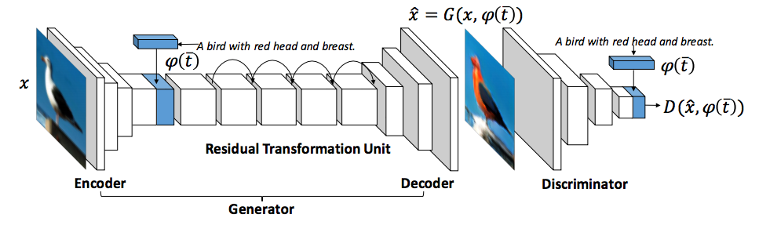
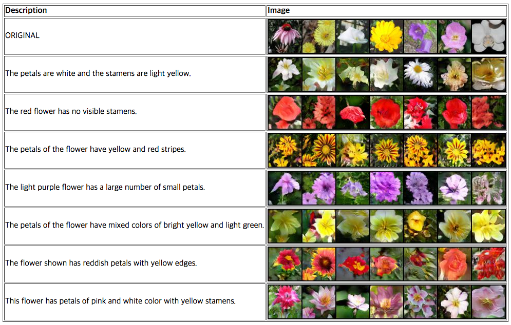
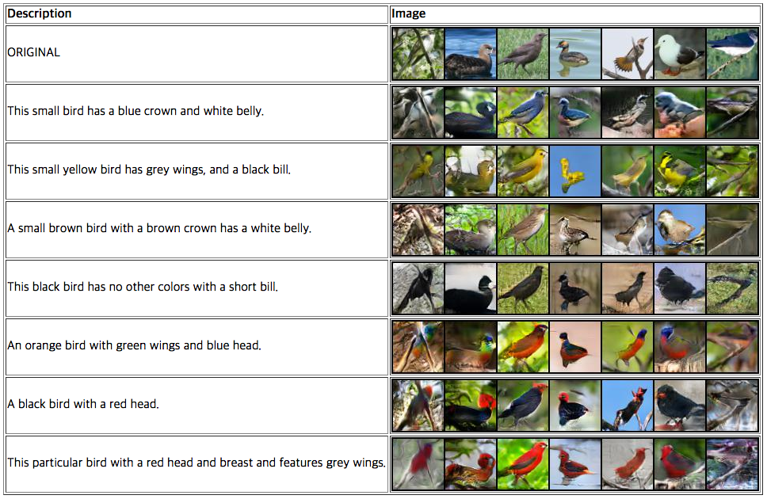

# Semantic Image Synthesis via Adversarial Learning

This is a PyTorch implementation of the paper [Semantic Image Synthesis via Adversarial Learning](https://arxiv.org/abs/1707.06873).

## Requirements
- [PyTorch](https://github.com/pytorch/pytorch) 0.2
- [Torchvision](https://github.com/pytorch/vision)
- [Pillow](https://pillow.readthedocs.io/en/4.2.x/)
- [fastText.py](https://github.com/salestock/fastText.py) (Note: if you have a problem when loading a pretrained model, try [my fixed code](https://github.com/woozzu/fastText.py/tree/feature/udpate-fasttext-to-f24a781-fix))
- [NLTK](http://www.nltk.org)

## Pretrained word vectors for fastText
Download a pretrained [English](https://s3-us-west-1.amazonaws.com/fasttext-vectors/wiki.en.zip) word vectors. You can see the list of pretrained vectors on [this page](https://github.com/facebookresearch/fastText/blob/master/pretrained-vectors.md).

## Datasets
- Oxford-102 flowers: [images](http://www.robots.ox.ac.uk/~vgg/data/flowers/102) and [captions](https://drive.google.com/file/d/0B0ywwgffWnLLMl9uOU91MV80cVU/view?usp=sharing)
- Caltech-200 birds: [images](http://www.vision.caltech.edu/visipedia/CUB-200-2011.html) and [captions](https://drive.google.com/file/d/0B0ywwgffWnLLLUc2WHYzM0Q2eWc/view?usp=sharing)

The caption data is from [this repository](https://github.com/reedscot/icml2016). After downloading, modify `CONFIG` file so that all paths of the datasets point to the data you downloaded.

## Run
- `scripts/train_text_embedding_[birds/flowers].sh`  
Train a visual-semantic embedding model using the method of [Kiros et al.](https://arxiv.org/abs/1411.2539).
- `scripts/train_[birds/flowers].sh`  
Train a GAN using a pretrained text embedding model.
- `scripts/test_[birds/flowers].sh`  
Generate some examples using original images and semantically relevant texts.

## Results

## Acknowledgements
- [Text to image synthesis](https://github.com/reedscot/icml2016)
- [StackGAN](https://github.com/hanzhanggit/StackGAN)

We would like to thank Hao Dong, who is one of the first authors of the paper [Semantic Image Synthesis via Adversarial Learning](https://arxiv.org/abs/1707.06873), for providing helpful advice for the implementation.